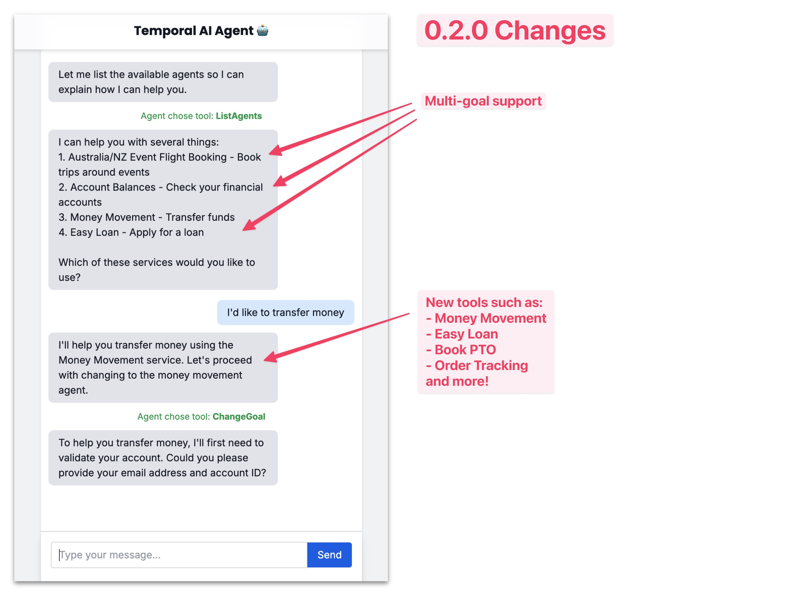

# Changelog

All notable changes to this project will be documented in this file.

## [0.2.0] - 2025-04-24

### Added
- **Multi‑goal agent architecture** with dynamic goal switching (`goal_choose_agent_type`, `ListAgents`, `ChangeGoal`).
    - See [the architecture guide](./architecture.md) and [setup guide](./SETUP.md).
- **New goal categories & agents**: HR PTO scheduling/checking, paycheck integration, Financial (balances, money movement, loan application), E‑commerce order tracking.
    - See [the guide for adding goals and tools](./adding-goals-and-tools.md).
- **Force Confirmation**: `SHOW_CONFIRM` will show a confirmation box before allowing the agent to run a tool.
- **Grok (`x.ai`) LLM provider** support via `GROK_API_KEY`.
- Extensive **docs**: `SETUP.md`, `architecture.md`, `architecture-decisions.md`, `adding-goals-and-tools.md`, plus new diagrams & assets.

### Changed
- **UI Confirmation Box** is less 'debug' looking and prettier.
- Package renamed to **`temporal_AI_agent`** and version bumped to **0.2.0** in `pyproject.toml`.
- Environment variables changed (see `.env_example`): (`RAPIDAPI_HOST_*`, `AGENT_GOAL` defaults, `GOAL_CATEGORIES`, `SHOW_CONFIRM`, `FIN_START_REAL_WORKFLOW`).

## [0.1.0] - 2025-01-04

### Added
- **Initial release** of the Temporal AI Agent demo.
- **Single goal agent** architecture with a single goal and agent type.
    - This is the agent demoed in the [YouTube video](https://www.youtube.com/watch?v=GEXllEH2XiQ).

[0.2.0]: https://github.com/temporal-community/temporal-ai-agent/pull/29