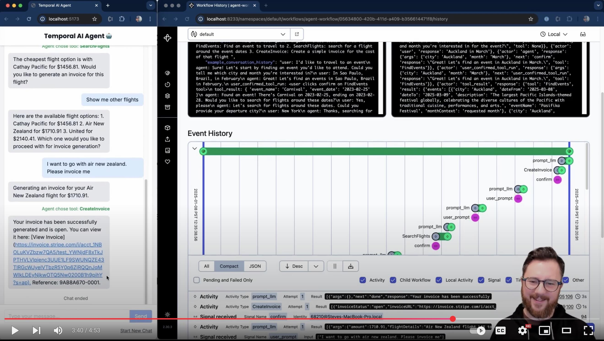

# Temporal AI Agent

This demo shows a multi-turn conversation with an AI agent running inside a Temporal workflow. The purpose of the agent is to collect information towards a goal, running tools along the way. There's a simple DSL input for collecting information (currently set up to use mock functions to search for public events, search for flights around those events, then create a test Stripe invoice for the trip).

The AI will respond with clarifications and ask for any missing information to that goal. You can configure it to use [ChatGPT 4o](https://openai.com/index/hello-gpt-4o/), [Anthropic Claude](https://www.anthropic.com/claude), [Google Gemini](https://gemini.google.com), [Deepseek-V3](https://www.deepseek.com/), [Grok](https://docs.x.ai/docs/overview) or a local LLM of your choice using [Ollama](https://ollama.com).

It's really helpful to [watch the demo (5 minute YouTube video)](https://www.youtube.com/watch?v=GEXllEH2XiQ) to understand how interaction works.

## Setup and Configuration
See [the Setup guide](./setup.md).

## Customizing Interaction & Tools
TODO

## Architecture
See [the architecture guide](./architecture.md).

## Productionalization & Adding Features
- In a prod setting, I would need to ensure that payload data is stored separately (e.g. in S3 or a noSQL db - the claim-check pattern), or otherwise 'garbage collected'. Without these techniques, long conversations will fill up the workflow's conversation history, and start to breach Temporal event history payload limits.
- A single worker can easily support many workflows - setting workflow ID differently would enable this
- Continue-as-new shouldn't be a big consideration for this use case (as it would take many conversational turns to trigger). Regardless, I should ensure that it's able to carry the agent state over to the new workflow execution.
- Perhaps the UI should show when the LLM response is being retried (i.e. activity retry attempt because the LLM provided bad output)
- Tests would be nice!

See [the todo](./todo.md) for more details.

See Customization for more details. <-- TODO

## For Temporal SAs
Check out the [slides](https://docs.google.com/presentation/d/1wUFY4v17vrtv8llreKEBDPLRtZte3FixxBUn0uWy5NU/edit#slide=id.g3333e5deaa9_0_0) here and the enablement guide here (TODO).
