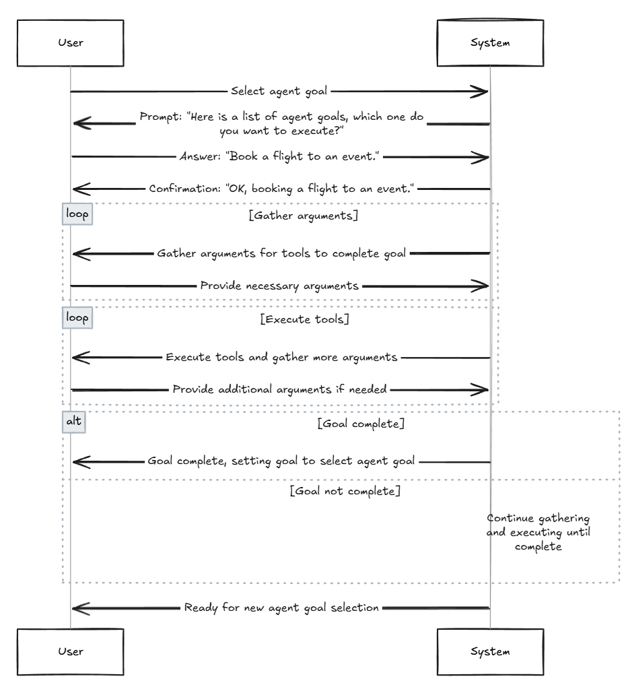

# Elements
These are the main elements of this system. 

## Workflow 
This is a [Temporal Workflow](https://docs.temporal.io/workflows) - a durable straightforward description of the process to be executed. For our example see [agent_goal_workflow.py](./workflows/agent_goal_workflow.py).
Temporal is used to make the process scalable, durable, reliable, secure, and visible.

### Workflow Responsibilities:
- Orchestrates interactive loop
- Prompts LLM, Users
- Keeps record of all interactions ([Signals, Queries, Updates](https://docs.temporal.io/develop/python/message-passing))
- Executes LLM durably
- Executes Tools durably
- Handles failures gracefully
- Human, LLM and tool interaction history stored for debugging and analysis

## Activities
These are [Temporal Activities](https://docs.temporal.io/activities). Defined as simple functions, they are auto-retried async/event driven behind the scenes. Activities durably execute Tools and the LLM. See [a sample activity](./activities/tool_activities.py).

## Tools 
Tools define the capabilities of the system. They are simple Python functions (could be in any language).
They are executed by Temporal Activities. They are “just code” - can connect to any API or system. They also are where the "hard" business logic is: you can validate and retry actions using code you write.
Failures are handled gracefully by Temporal.

Activities + Tools turn the probabalistic input from the user and LLM into deterministic action.

## Prompts
Prompts are where the instructions to the LLM & users is. Prompts are made up of initial instructions, goal instructions, and tool instructions. 
See [agent prompts](./prompts/agent_prompt_generators.py) and [goal & tool prompts](./tools/goal_registry.py). 

This is where you can add probabalistic business logic, to control process flow, describe what to do, and give instruction and validation for the LLM.

## LLM
Probabalistic execution: it will _probably_ do what you tell it to do.
Turns the guidance from the prompts (see [agent prompts](./prompts/agent_prompt_generators.py) and [goal prompts](./tools/goal_registry.py)) into 
You have a choice of providers - see [setup](./setup.md). 
The LLM:
- Validates user input for tools
- Drives toward goal selected by user
- Decides when to execute tools
- Formats input and interprets output for tools
- is executed by Temporal Activities
    - API failures and logical failures are handled transparently

## Interaction
Interaction is managed with Temporal Signals and Queries. These are durably stored in Workflow History. 
Can be used for analysis and debugging. It's all “just code” so it's easy to add new Signals and Queries. 
Input can be very dynamic, just needs to be serializable.

The workflow executes in a loop: gathering input, validating input, executing tools, managing prompts, and then waiting for input.

Here's a more detailed example for gathering parameters for tools:

# Architecture Model
Now that we have the pieces and what they do, here is a more complete diagram of how the pieces work together: 

# Adding features
Want to add more tools, See [adding goals and tools](./adding-goals-and-tools.md).